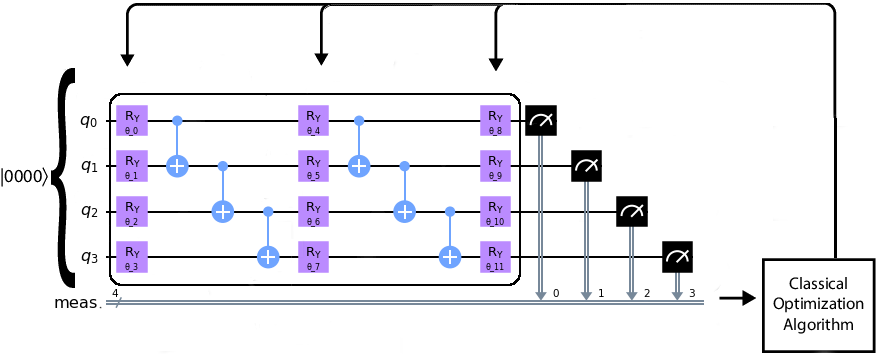

# Quantum Structure Prediction

Code repository for my Physics Part III project titled: 'Structure Prediction with Quantum Computers'. Conducted with the help of Chris Pickard and Guglielmo Mazzolo of IBM. The aim of the project was to show if quantum 

# How to Install
The main file is the quant.py file which return the images and data I used in my viva. qasm_distribution is the main bit of quantum code in the file. 

# File Description
- circuit_and_histrogram.ipynb: Generates the circuit image above and structure graph 
- optimize.py: Contains the classical code used in all my classical algorithms
- quant.py: Main file which generates data used in the project
- quantized.py: Temporary file to play around the code Guglielmo sent me
- structurePredict.py: Classical continous optimization algorithm
- structurePredictDiscrete.py: Discrete classical optimization algorithm
- structurePredictProbability.py: File used to generate a key figure in my paper

# License and Author info
Code written by me with guidance from Guglielmo. All work in the repository is created by me. 